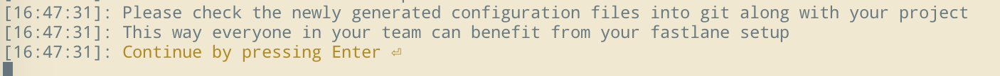

# 使用Fastlane发布到firim


## `Fastlane `的安装

```undefined
sudo gem install fastlane
```

```undefined
fastlane --version
```


## 工程配置

- 开发者账号、证书自动配置
  
- 可以手动`archive `试一次，表示当前工程本身可以正常打包
  
- 项目版本号的管理设置

   - 改动后
      
   	
   - 改动前

      


## 在项目中使用Fastlane

#### 初始化fastlane

进入到项目根目录

```
fastlane init 
```

### `fastlane init ` 过程的设置

第一步选`4`，我们自己编写`Fastfile`，后面一直按 `enter`

截图如下：

- 

- 

- 

- 


#### 依赖cocoapods

- 编辑 根目录下的Gemfile，添加以下一行：

```
gem 'cocoapods' 
```

这样Gemfile中说明需要依赖cocoapods

- 安装Gemfile中的依赖

```
bundle install  
```
`man bundle`查看工具介绍

#### 添加Fastlane依赖的额外插件

fastlane依赖插件:

用于改变项目的版本号

 ```
fastlane add_plugin versioning 
 ```

用于上传到fir

```undefined
fastlane add_plugin firim 
```

**Fastlane中需要的默认的插件** 后续需要专门介绍


## `Fastfile `


### `Fastfile` 中的自动化流程:

- 拉取dev

- 清理pod

- 安装pod

- 修改版本号

- Commit & push to dev

- 编译

- 打包

- 发布到fir.im


### `Fastfile`中代码的编写

- 工程名设定
- Target 名
- `source control`相关
-  `gym` 打包类型

  - development

  - adhoc

  - enterprise

- 上传到firim
  - `firim` 的 `apitoken`


 

## 错误处理

fastfile中的某些语句依赖的插件没有安装

